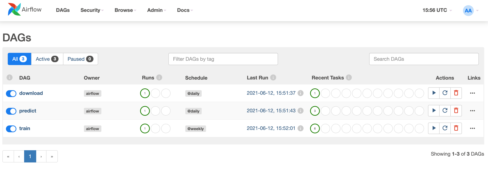
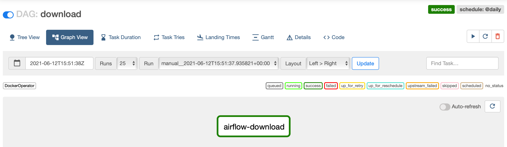
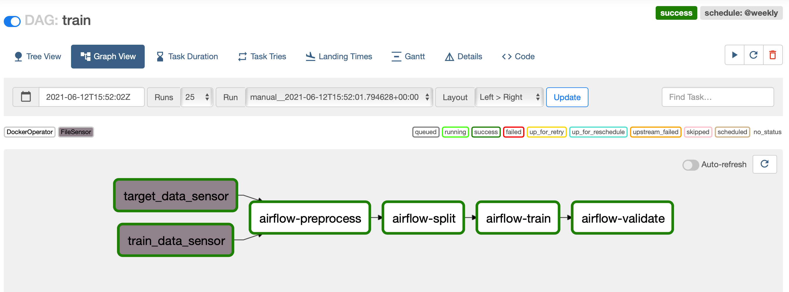
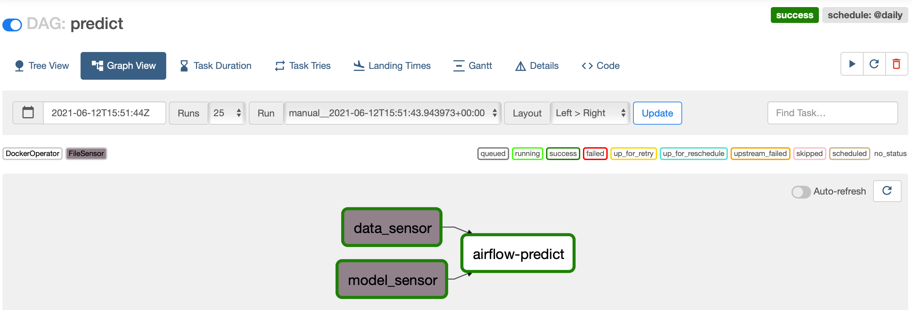
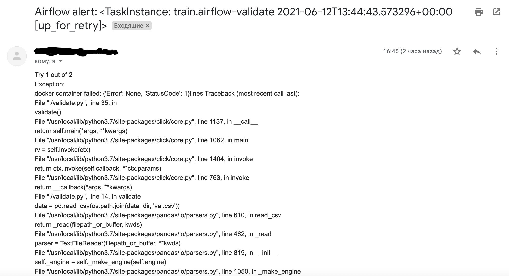

## Машинное обучение в продакшене
### Домашнее задание №3 

Автор: [viconstel](https://data.mail.ru/profile/k.elizarov/)

Перейдите в директорию домашнего задания:
 ```
 cd airflow_ml_dags/
```
Сборка образов и запуск Airflow:
```
docker-compose up --build
```
Запуск тестов:
```
sh env.sh && pytest -v tests/test_dags.py
```
Скриншоты:
1. Список всех дагов

2. Даг download

3. Даг train

4. Даг predict

5. E-mail с failure alert
